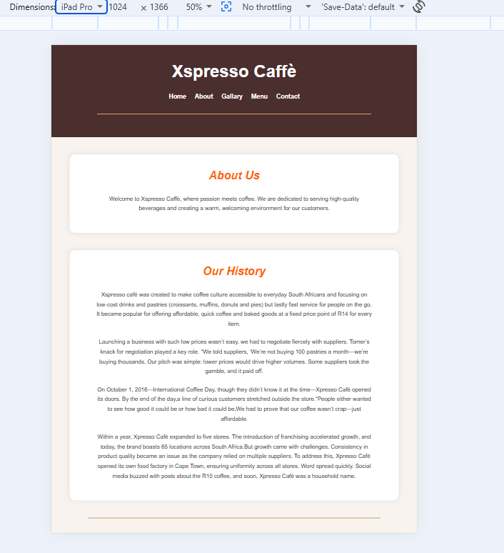
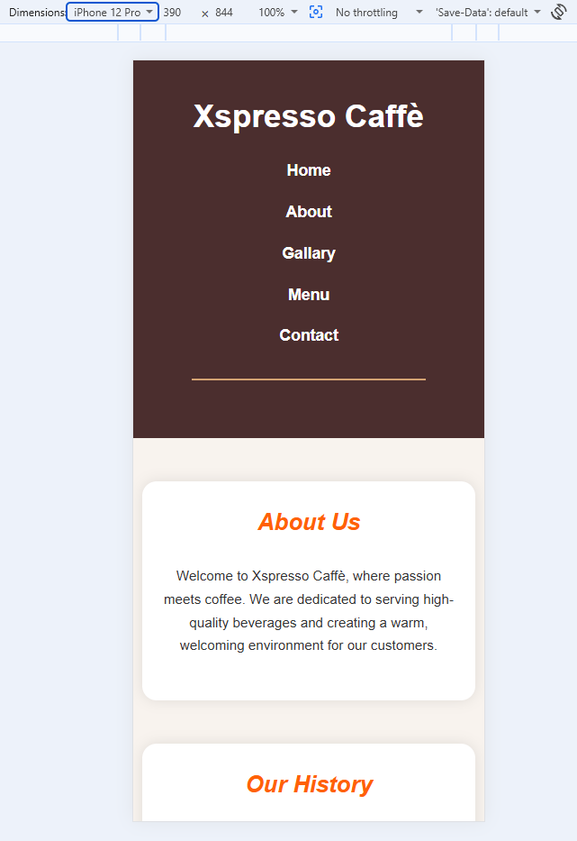

# Xspresso Caffè Website

## Responsive Design Testing

### Desktop View

### Tablet View

### Mobile View

## Features

* Responsive design
* Navigation menu
* Gallery page
* Menu page
* Contact form
* Google Maps integration
* JavaScript form validation
* SEO optimization

## Technologies Used

* HTML5
* CSS3
* JavaScript

## references
Responsive web design improves usability across different devices (MDN Web Docs, 2026).

HTML5 form validation helps ensure that users enter valid information (W3Schools, 2026).

Google Maps was embedded to provide location information for customers (Google Maps, 2026).
